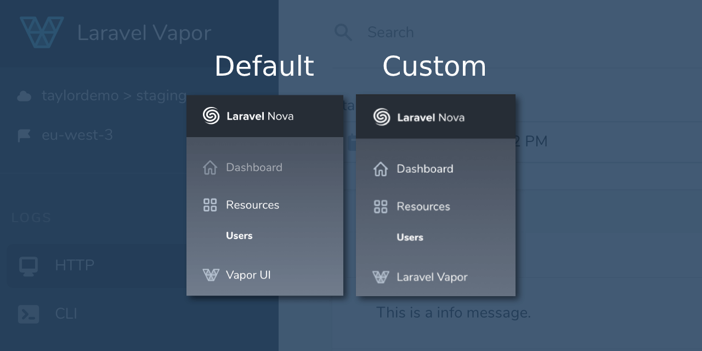

## Laravel Nova Vapor UI Link
[](https://packagist.org/packages/fidum/laravel-nova-vapor-ui-link)
[](https://twitter.com/danmasonmp)

Adds link to the [Laravel Vapor UI](https://docs.vapor.build/1.0/introduction.html#installing-the-vapor-ui-dashboard)
Dashboard in the [Laravel Nova](https://nova.laravel.com/) sidebar. 

Link automatically hidden if current user hasn't access to the _Vapor UI Dashboard_ based on the `viewVaporUI` gate defined 
in your  `App\Providers\VaporUiServiceProvider::gate` method. In order to be consistent with Vapor UI it will always show 
on `local` and `testing` environments. For more information, checkout the [documentation](https://docs.vapor.build/1.0/introduction.html#dashboard-authorization).



## Installation

At first, install via composer:

```bash
composer require fidum/laravel-nova-vapor-ui-link
```

Next up, register the link in the `tools` method of the `NovaServiceProvider`:

```php
// app/Providers/NovaServiceProvider.php

// ...

public function tools()
{
    return [
        new \Fidum\NovaVaporUILink\VaporUILink,
    ];
}
```

## Customization

By default, link label is - **Vapor UI**, if you prefer to customize it, just pass new label text into constructor:

```php
// app/Providers/NovaServiceProvider.php

public function tools()
{
    return [
        new \Fidum\NovaVaporUILink\VaporUILink('Custom Label'),

        // or
        \Fidum\NovaVaporUILink\VaporUILink::make('Custom Label')
    ];
}
```

If you need to customize link `target` attribute (for example to open a page in a new tab), just pass it as second parameter into constructor.
A value should be without prepended underscore `_`:

```php
// app/Providers/NovaServiceProvider.php

public function tools()
{
    return [
        new \Fidum\NovaVaporUILink\VaporUILink(null, 'blank'),
        
        // or
        \Fidum\NovaVaporUILink\VaporUILink::make()->target('blank'),
    ];
}
```

# <p align="center"></p>

## Changelog

Please see [CHANGELOG](CHANGELOG.md) for more information on what has changed recently.

## Contributing

Please see [CONTRIBUTING](CONTRIBUTING.md) for details.

## Security

If you discover any security related issues, please email :author_email instead of using the issue tracker.

## Credits

- [All Contributors](../../contributors)

## License

The MIT License (MIT). Please see [License File](LICENSE.md) for more information.
